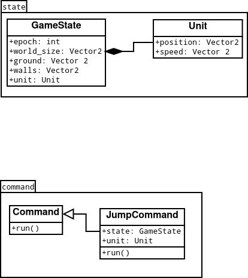

## Подзадачи

  - менюшка
  - отрисовка
  - звук
  - генерация
  - механика
  - ##### Andrey
      - классы и их абиллки
        - agility: подкат вместо приседания
        - strength: способность: щит?: меньшее отталкивание от врагов
      - типы врагов
        - ???

## Набросок менюшки:

## Диаграмма классов

